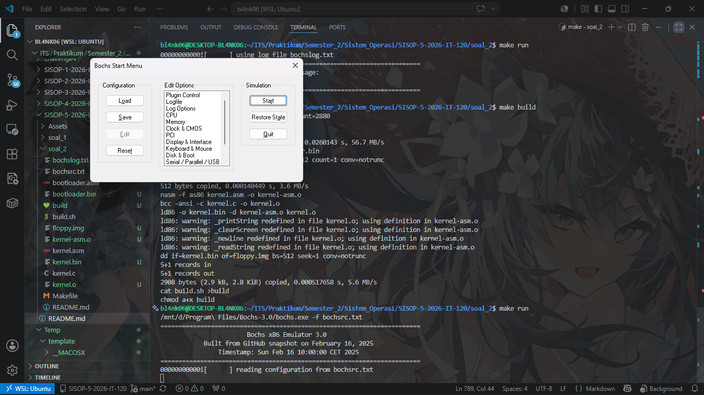
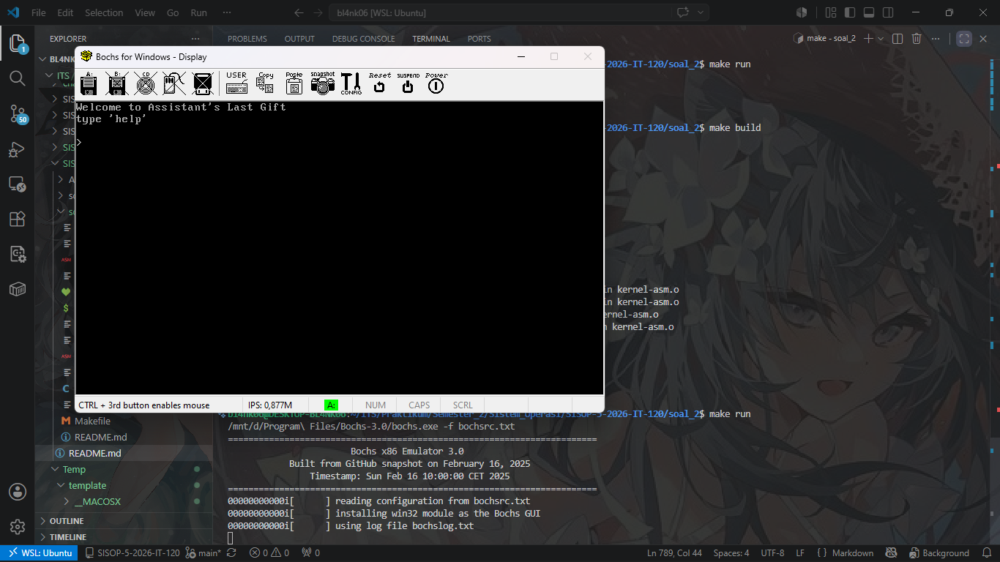
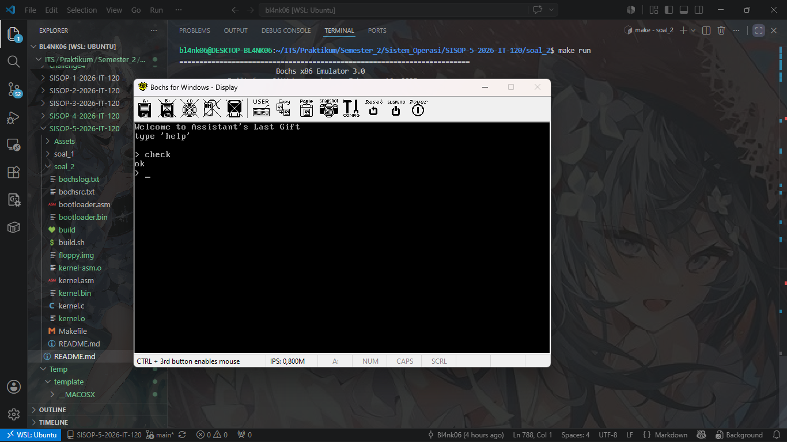
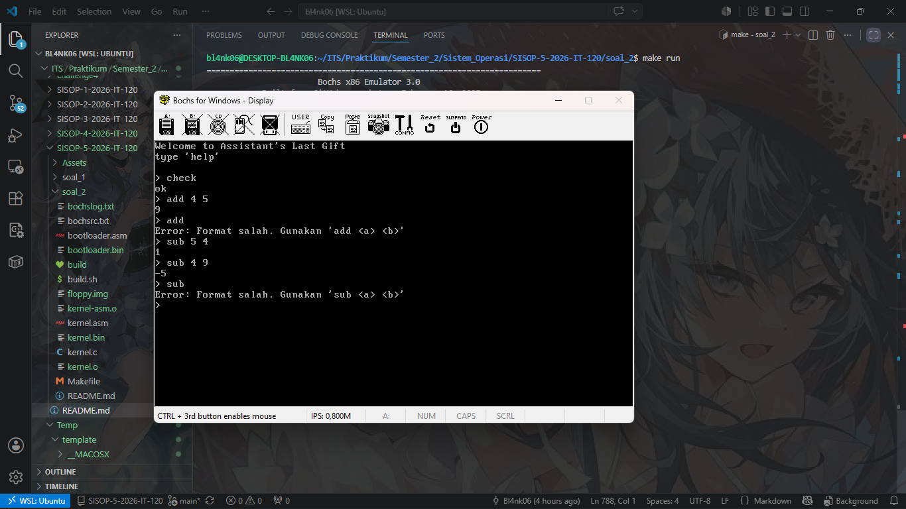
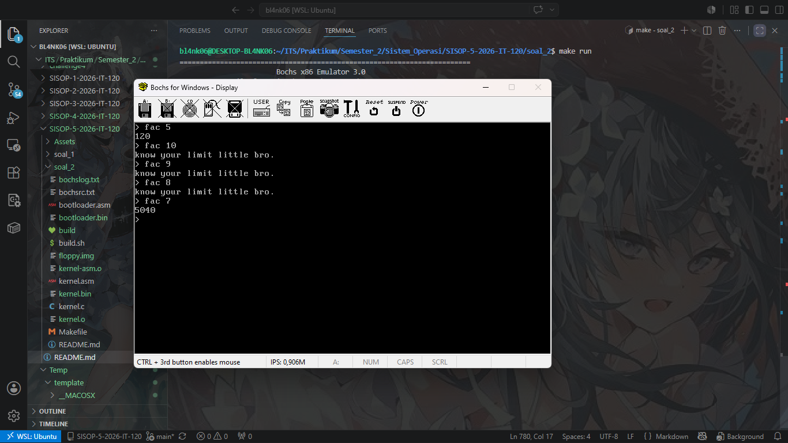
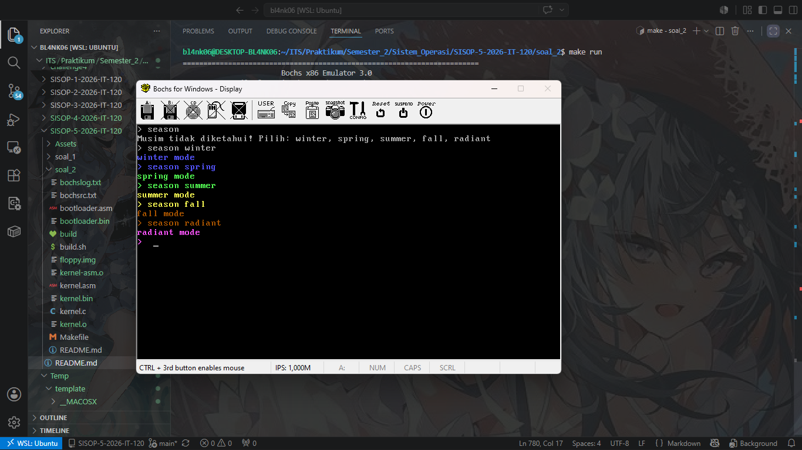
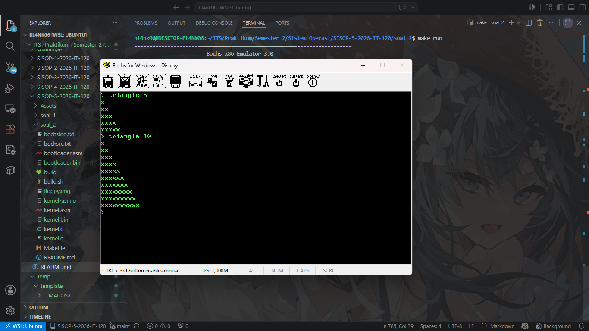
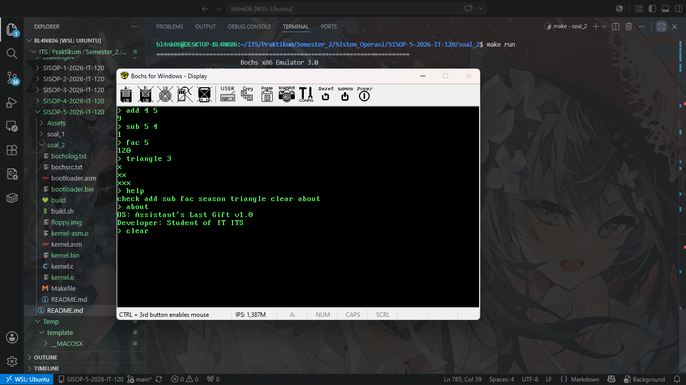
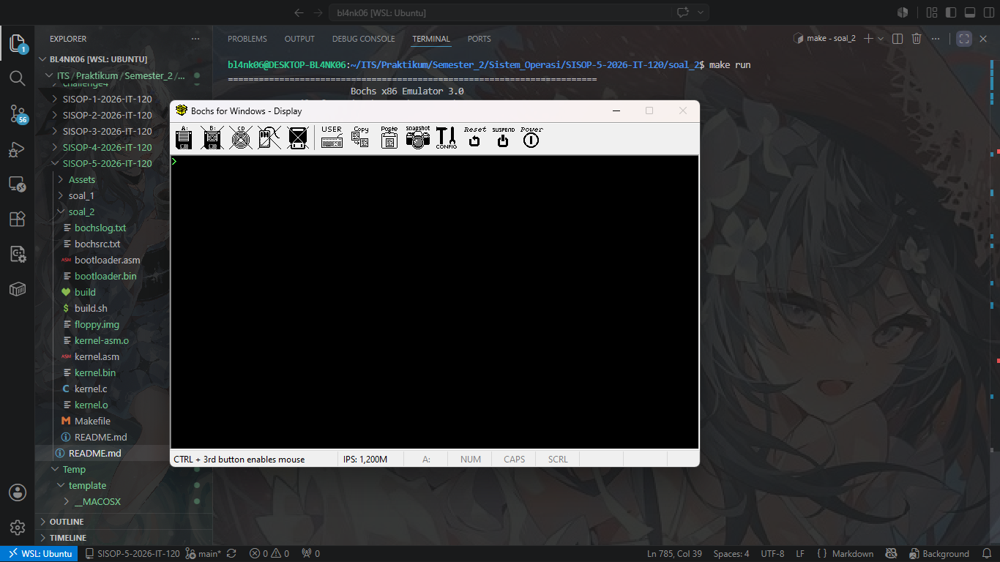

# SISOP-5-2026-IT-120

## Member

| No  | Nama                        | NRP        |
| --- | --------------------------- | ---------- |
| 1   | Rido Patra Yudhistira Edwin | 5027251120 |

## Reporting

### Soal 1

#### Penjelasan

#### Output
- (Tidak ada)

#### Kendala
Beban komputasi terlalu berat untuk spesifikasi *device* lokal.

---

### Soal 2

#### Kode
`bochsrc.txt`
```txt
megs: 32

# Arahkan romimage dan vgaromimage ke folder instalasi Bochs 3.0 di Drive D
# Jika di folder aslinya ada ekstensi .bin, tambahkan .bin di akhirnya:
romimage: file="D:/Program Files/Bochs-3.0/BIOS-bochs-latest"
vgaromimage: file="D:/Program Files/Bochs-3.0/VGABIOS-lgpl-latest.bin"

boot: floppy
floppya: 1_44=floppy.img, status=inserted
log: bochslog.txt
mouse: enabled=0

# Menggunakan display GUI bawaan Windows (Sangat Stabil & Ringan)
display_library: win32

```

`kernel.asm`
```asm
bits 16

global _start
global _putInMemory
global _getChar
global _printString   ; <--- Daftarkan secara global agar bisa dibaca kernel.c
global _clearScreen   ; <--- Daftarkan secara global
global _newline       ; <--- Daftarkan secara global
global _readString    ; <--- Daftarkan secara global
global _updateCursor  ; <--- [PASANG DI SINI 1] Daftarkan kursor global
extern _main

_start:

    cli

    mov ax, cs
    mov ds, ax
    mov es, ax

    sti

    call _main

.hang:
    jmp .hang


_putInMemory:
    push bp
    mov bp, sp

    push ds

    mov ax, [bp+4]
    mov si, [bp+6]
    mov cl, [bp+8]

    mov ds, ax
    mov [si], cl

    pop ds

    pop bp
    ret

; === 1. FUNGSI UNTUK MENGAMBIL KARAKTER DARI KEYBOARD ===
_getChar:
    mov ah, 0x00        ; Interrupt membaca karakter tekan
    int 0x16            ; BIOS Keyboard Service (Hasil ASCII masuk ke AL)
    mov ah, 0x00        ; Bersihkan AH, return value bcc diletakkan di AX
    ret

; === 2. FUNGSI UNTUK MENCETAK STRING KE LAYAR ===
_printString:
    push bp
    mov bp, sp
    mov si, [bp+4]      ; Mengambil argumen pointer char* string (alamat memori)

.loop_print:
    lodsb               ; Muat karakter dari [DS:SI] ke register AL, lalu SI++
    cmp al, 0           ; Cek apakah karakternya string terminator '\0'
    je .end_print       ; Jika iya, lompat ke selesai
    
    mov ah, 0x0E        ; Mode teletype BIOS (Cetak karakter ke layar)
    int 0x10            ; BIOS Video Service
    jmp .loop_print

.end_print:
    pop bp
    ret

; === 3. FUNGSI UNTUK MEMBERSIHKAN LAYAR ===
_clearScreen:
    mov ah, 0x00        ; Set video mode
    mov al, 0x03        ; Mode teks standar 80x25 warna
    int 0x10            ; BIOS Video Service (Otomatis membersihkan layar)
    ret

; === 4. FUNGSI UNTUK BARIS BARU (NEWLINE) ===
_newline:
    mov ah, 0x0E
    mov al, 0x0D        ; Carriage Return (\r) -> Mengembalikan kursor ke kiri
    int 0x10
    mov al, 0x0A        ; Line Feed (\n) -> Menurunkan kursor ke baris baru
    int 0x10
    ret

; === 5. FUNGSI UNTUK MEMBACA SATU BARIS STRING DARI KEYBOARD ===
_readString:
    push bp
    mov bp, sp
    mov di, [bp+4]      ; Mengambil argumen buffer char* dari C
    
.loop_read:
    mov ah, 0x00        ; Baca input keyboard
    int 0x16
    
    cmp al, 0x0D        ; Cek apakah user menekan tombol ENTER (\r)
    je .end_read        ; Jika ENTER, selesai membaca
    
    mov [di], al        ; Masukkan karakter dari AL ke alamat memori buffer [DI]
    inc di              ; Geser pointer memori buffer ke indeks berikutnya
    
    mov ah, 0x0E        ; Cetak karakter yang diketik ke layar (Echoing)
    int 0x10
    jmp .loop_read

.end_read:
    mov byte [di], 0    ; Tambahkan string terminator '\0' di akhir array char
    mov ah, 0x0E
    mov al, 0x0D        ; Buat kursor turun ke bawah setelah enter
    int 0x10
    mov al, 0x0A
    int 0x10
    
    pop bp
    ret

; === 6. FUNGSI UPDATE KURSOR HARDWARE VIA BIOS ===
; [PASANG DI SINI 2] Diletakkan di paling bawah agar rapi
_updateCursor:
    push bp
    mov bp, sp
    
    mov ax, [bp+4]      ; Ambil argumen nilai 'cursor' dari C (misal: 80, 160, dst)
    
    ; Cari koordinat Baris (Row) dan Kolom (Column)
    ; Baris = cursor / 80, Kolom = cursor % 80
    mov cl, 80
    div cl              ; AX dibagi 80. Hasil bagi (Baris) di AL, Sisa bagi (Kolom) di AH
    
    mov dh, al          ; DH = Baris (Row)
    mov dl, ah          ; DL = Kolom (Column)
    mov bh, 0           ; BH = Page number (0)
    
    mov ah, 0x02        ; Service BIOS: Set Cursor Position
    int 0x10            ; Panggil interupsi video BIOS
    
    pop bp
    ret

```

`kernel.c`
```c
int cursor = 0;
char color = 0x07;

void putInMemory(int segment, int address, char character);
int getChar();

/*
 * Final Challenge
 *
 * Commands:
 * - check
 * - add <a> <b>
 * - sub <a> <b>
 * - fac <n>
 * - season <name>
 * - triangle <n>
 * - clear
 * - about
 *
 * Season list:
 * - winter
 * - spring
 * - summer
 * - fall
 * - radiant
 *
 * Restrictions:
 * - no stdlib
 * - avoid division (/)
 * - avoid modulo (%)
 */

/*
 * TODO:
 * 1. printChar()       v
 * 2. printString()     v
 * 3. clearScreen()     v
 * 4. readString()      v
 * 5. strcmp()          v
 * 6. startsWith()      v
 * 7. atoi()            v
 * 8. intToString()     v
 * 9. factorial()       v
 * 10. add handler
 * 11. sub handler
 * 12. fac handler
 * 13. season handler
 * 14. triangle handler
 * 15. shell loop
 */


// 1. DEKLARASI / PROTOTIPE FUNGSI (Agar main() kenal)
void putInMemory(int segment, int address, char character);
int getChar();
void printChar(char character);
void printString(char* string);
void clearScreen();
void readString(char* string);
int strcmp(char* str1, char* str2);
void newline();
void updateCursor(int cursor_pos); // <--- Tambahkan ini di baris deklarasi atas
int startsWith(char* str, char* prefix);
int atoi(char* str);
void intToString(int num, char* str);
int factorial(int n);


// 2. FUNGSI UTAMA (Wajib Paling Atas agar Sukses Booting)
void main() {

    char cmd[64];

    clearScreen();

    // Sesuaikan dengan ucapan dari Asisten Praktikum di gambar
    printString("Welcome to Assistant's Last Gift");
    newline();

    printString("type 'help'");
    newline();
    newline();

    while (1) {

        printString("> ");

        readString(cmd);

        /*
         * TODO:
         * command handler
         *
         * example:
         *
         * if (strcmp(cmd, "check")) {
         *     printString("ok");
         * }
         */

        // --- TODO: command handler untuk 'check' ---
        if (strcmp(cmd, "check")) {
            printString("ok");
            newline();
        } 
        // --- Handler Perintah 'help' [SUDAH DIPERBARUI] ---
        else if (strcmp(cmd, "help")) {
            printString("check add sub fac season triangle clear about");
            newline();
        }
        else if (startsWith(cmd, "add ")) {
            char* arg1 = cmd + 4; // Menunjuk ke awal angka pertama
            char* arg2 = 0;
            int i = 4;
            int num1, num2, hasil;
            char hasilStr[16];

            // Cari spasi pemisah antara angka pertama dan kedua
            while (cmd[i] != '\0') {
                if (cmd[i] == ' ') {
                    cmd[i] = '\0'; // Potong string di sini agar arg1 hanya membaca angka pertama
                    arg2 = cmd + i + 1; // Angka kedua dimulai setelah spasi
                    break;
                }
                i++;
            }

            if (arg2 != 0) {
                num1 = atoi(arg1);
                num2 = atoi(arg2);
                hasil = num1 + num2;

                intToString(hasil, hasilStr);
                printString(hasilStr);
                newline();
            } else {
                printString("Error: Format salah. Gunakan 'add <a> <b>'");
                newline();
            }
        }
        else if (startsWith(cmd, "sub ")) {
            char* arg1 = cmd + 4; // Menunjuk ke awal angka pertama setelah "sub "
            char* arg2 = 0;
            int i = 4;
            int num1, num2, hasil;
            char hasilStr[16];

            // Cari spasi pemisah antara angka pertama dan kedua
            while (cmd[i] != '\0') {
                if (cmd[i] == ' ') {
                    cmd[i] = '\0'; // Potong string di spasi pemisah
                    arg2 = cmd + i + 1; // Angka kedua dimulai setelah spasi
                    break;
                }
                i++;
            }

            if (arg2 != 0) {
                num1 = atoi(arg1);
                num2 = atoi(arg2);
                hasil = num1 - num2; // Operasi Pengurangan

                intToString(hasil, hasilStr);
                printString(hasilStr);
                newline();
            } else {
                printString("Error: Format salah. Gunakan 'sub <a> <b>'");
                newline();
            }
        }
        else if (startsWith(cmd, "fac ")) {
            char* arg = cmd + 4; // Menunjuk ke angka setelah "fac "
            int n = atoi(arg);
            int hasil = factorial(n);
            char hasilStr[16];

            if (hasil == -1) {
                // Sesuai request asisten yang super chill di soal
                printString("know your limit little bro.");
                newline();
            } else {
                intToString(hasil, hasilStr);
                printString(hasilStr);
                newline();
            }
        }
        else if (startsWith(cmd, "season ")) {
            char* arg = cmd + 7; // Menunjuk ke nama musim setelah "season "

            if (strcmp(arg, "winter")) {
                color = 0x09; // Ubah warna global ke Biru Terang
                printString("winter mode");
                newline();
            } 
            else if (strcmp(arg, "spring")) {
                color = 0x0A; // Ubah warna global ke Hijau Terang
                printString("spring mode");
                newline();
            } 
            else if (strcmp(arg, "summer")) {
                color = 0x0E; // Ubah warna global ke Kuning Terang
                printString("summer mode");
                newline();
            } 
            else if (strcmp(arg, "fall")) {
                color = 0x06; // Ubah warna global ke Cokelat
                printString("fall mode");
                newline();
            } 
            else if (strcmp(arg, "radiant")) {
                color = 0x0D; // Ubah warna global ke Pink/Light Magenta
                printString("radiant mode");
                newline();
            } 
            else {
                printString("Musim tidak diketahui! Pilih: winter, spring, summer, fall, radiant");
                newline();
            }
        }
        else if (startsWith(cmd, "triangle ")) {
            char* arg = cmd + 9; // Menunjuk ke angka setelah "triangle "
            int n = atoi(arg);
            int i, j;

            // Proteksi jika input minus atau nol
            if (n <= 0) {
                printString("Error: Masukkan angka lebih dari 0.");
                newline();
            } else {
                // Loop luar untuk mengatur tinggi baris
                for (i = 1; i <= n; i++) {
                    // Loop dalam untuk mencetak karakter 'x' di baris tersebut
                    for (j = 1; j <= i; j++) {
                        printChar('x');
                    }
                    newline(); // Pindah baris setelah karakter 'x' di baris itu beres
                }
            }
        }
        // --- Handler Perintah 'clear' ---
        else if (strcmp(cmd, "clear")) {
            clearScreen();
        }
        // --- Handler Perintah 'about' ---
        else if (strcmp(cmd, "about")) {
            printString("OS: Assistant's Last Gift v1.0");
            newline();
            printString("Developer: Student of IT ITS");
            newline();
        }
        else {
            printString("Command tidak dikenali.");
            newline();
        }

    }
}


// 3. IMPLEMENTASI FITUR (TODO 1 - 5)
// TODO 1. PrintChar()
void printChar(char character) {
    putInMemory(0xB800, cursor * 2, character);      
    putInMemory(0xB800, (cursor * 2) + 1, color);    
    cursor++; 
    updateCursor(cursor); // <--- Selipkan di sini
}

// TODO 2. PrintString()
void printString(char* string) {
    int i = 0;
    while (string[i] != '\0') {
        printChar(string[i]);
        i++;
    }
}

// TODO 3. ClearScreen()
void clearScreen() {
    int i;
    for (i = 0; i < 2000; i++) {
        putInMemory(0xB800, i * 2, ' ');       
        putInMemory(0xB800, (i * 2) + 1, 0x07); 
    }
    cursor = 0; 
    updateCursor(cursor); // <--- Selipkan ini biar kursor fisik ikut reset ke (0,0) saat boot
}

// TODO 4. ReadString()
void readString(char* string) {
    int i = 0;
    while (1) {
        char ch = getChar(); 

        if (ch == 0x0D) { // Enter
            string[i] = '\0'; 
            newline();        
            break;
        } 
        else if (ch == 0x08) { // Backspace
            if (i > 0) {
                i--;
                cursor--;        
                printChar(' ');  
                cursor--;        
            }
        } 
        else { 
            string[i] = ch;
            printChar(ch); 
            i++;
        }
    }
}

// TODO 5. Strcmp()
int strcmp(char* str1, char* str2) {
    int i = 0;
    while (str1[i] != '\0' && str2[i] != '\0') {
        if (str1[i] != str2[i]) {
            return 0; 
        }
        i++;
    }
    if (str1[i] == '\0' && str2[i] == '\0') {
        return 1;
    }
    return 0;
}

// Fungsi Newline versi C
void newline() {
    int baris_sekarang = 0;
    while (baris_sekarang <= cursor) {
        baris_sekarang += 80;
    }
    cursor = baris_sekarang;
    updateCursor(cursor); // <--- Selipkan di sini
}

// TODO 6. StartsWith()
// Fungsi untuk mengecek apakah suatu string diawali oleh substring tertentu
int startsWith(char* str, char* prefix) {
    int i = 0;
    while (prefix[i] != '\0') {
        if (str[i] != prefix[i]) {
            return 0; // Karakternya beda, berarti bukan prefix-nya
        }
        i++;
    }
    return 1; // Semua karakter prefix cocok!
}

// TODO 7. Atoi()
// Mengubah string angka menjadi integer murni
int atoi(char* str) {
    int res = 0;
    int i = 0;
    
    // Geser jika ada spasi di awal string argumen
    while (str[i] == ' ') {
        i++;
    }

    while (str[i] >= '0' && str[i] <= '9') {
        res = res * 10 + (str[i] - '0');
        i++;
    }
    return res;
}

// TODO 8. IntToString() - Upgraded version for Negative Numbers
void intToString(int num, char* str) {
    int i = 0;
    int j = 0;
    char temp;
    int isNegative = 0;

    // Handle jika angkanya tepat 0
    if (num == 0) {
        str[i++] = '0';
        str[i] = '\0';
        return;
    }

    // Cek apakah angka bernilai negatif
    if (num < 0) {
        isNegative = 1;
        num = -num; // Ubah ke positif dulu untuk diekstrak digitnya
    }

    // Ambil digit dari belakang
    while (num > 0) {
        int quotient = num / 10; 
        int rem = num - (quotient * 10);
        str[i++] = rem + '0';
        num = quotient;
    }

    // Jika awalnya negatif, tambahkan karakter '-' di belakang sebelum dibalik
    if (isNegative) {
        str[i++] = '-';
    }
    str[i] = '\0';

    // Balikkan string
    i--;
    while (j < i) {
        temp = str[j];
        str[j] = str[i];
        str[i] = temp;
        j++;
        i--;
    }
}

// TODO 9. Factorial()
// Menghitung faktorial dengan proteksi overflow untuk sistem 16-bit
int factorial(int n) {
    int res = 1;
    int i;

    // Faktorial bilangan negatif tidak terdefinisi dalam case ini
    if (n < 0) return -1;
    
    // 0! atau 1! adalah 1
    if (n == 0 || n == 1) return 1;

    for (i = 2; i <= n; i++) {
        // Proteksi overflow 16-bit signed integer (Max: 32767)
        // Kita cek apakah res * i akan melebihi 32767
        // Menggunakan trik pembagian konstan: jika 32767 / i < res, maka pasti overflow!
        if (32767 / i < res) {
            return -1; // Overflow terdeteksi!
        }
        res = res * i;
    }
    return res;
}

```

`Makefile`
```makefile
prepare:
	dd if=/dev/zero of=floppy.img bs=512 count=2880

bootloader:
	nasm -f bin bootloader.asm -o bootloader.bin
	dd if=bootloader.bin of=floppy.img bs=512 count=1 conv=notrunc

kernel:
	nasm -f as86 kernel.asm -o kernel-asm.o
	bcc -ansi -c kernel.c -o kernel.o
	ld86 -o kernel.bin -d kernel-asm.o kernel.o 
	dd if=kernel.bin of=floppy.img bs=512 seek=1 conv=notrunc

build: prepare bootloader kernel

run:
	/mnt/d/Program\ Files/Bochs-3.0/bochs.exe -f bochsrc.txt

```

#### Penjelasan
Pada soal ini, praktikan diminta untuk mengembangkan sistem operasi mini berbasis teks (CLI Shell) di dalam lingkungan emulator Bochs 16-bit real mode. Pengembangan ini dibangun dengan melakukan modifikasi dan melengkapi berkas benih (*boilerplate template*) yang disediakan pada `kernel.asm` dan `kernel.c`.

Berikut adalah rincian fungsionalitas dan pemrosesan kode yang berhasil diimplementasikan dari kondisi *template* mentah:

**a. Manajemen Environment & Otomatisasi Build (`Makefile` & `bochsrc.txt`)**
Modifikasi dilakukan pada berkas `bochsrc.txt` bawaan *template* untuk mengalihkan pustaka tampilan dari `sdl2` menuju komponen `win32` agar emulasi GUI Bochs berjalan jauh lebih ringan dan stabil di Windows host. Berkas `Makefile` dikonfigurasi untuk menyatukan kompilasi biner as86 assembly dan compiler `bcc`:
```makefile
kernel:
	nasm -f as86 kernel.asm -o kernel-asm.o
	bcc -ansi -c kernel.c -o kernel.o
	ld86 -o kernel.bin -d kernel-asm.o kernel.o 
	dd if=kernel.bin of=floppy.img bs=512 seek=1 conv=notrunc

```

**b. Subsistem I/O Dasar & Validasi Perintah (`check`)**
Fungsi interupsi baca tulis dasar teks seperti `_printString` dan `_readString` yang awalnya kosong pada *template* dihidupkan kembali memanfaatkan *BIOS interrupt service* `int 0x10` (layar teks VGA) dan `int 0x16` (pembacaan keyboard) pada `kernel.asm`.
Untuk mencocokkan masukan string command tanpa menggunakan pustaka standar `string.h`, fungsi pembantu `strcmp` disematkan:

```c
int strcmp(char* str1, char* str2) {
    int i = 0;
    while (str1[i] != '\0' && str2[i] != '\0') {
        if (str1[i] != str2[i]) return 0; 
        i++;
    }
    return (str1[i] == '\0' && str2[i] == '\0');
}

```

Jika input `cmd` bernilai tepat `"check"`, shell utama di dalam `main()` akan merespon dengan mencetak string `"ok"`.

**c. Pemrosesan Aritmatika Spasi (`add` & `sub`)**
Fitur operasi matematika dirancang untuk mampu membelah parameter string argumen numerik pasca token instruksi utama `"add "` atau `"sub "`. Pemisahan dilakukan dengan mendeteksi letak spasi pembatas kedua dan menginjeksikan karakter null terminator `\0` di tengah buffer secara paksa.

```c
// Modifikasi fungsi intToString() untuk mendeteksi biner negatif pada fitur sub:
if (num < 0) {
    isNegative = 1;
    num = -num; 
}
if (isNegative) str[i++] = '-';

```

**d. Kalkulator Faktorial Protektif (`fac`)**
Untuk mencegah terjadinya malfungsi *system crash* akibat lonjakan memori integer pada register 16-bit signed (maksimal `32.767`), sebuah interupsi logika pembagian konstan disisipkan ke dalam iterasi loop perkalian sebelum data overflow merusak alokasi memori:

```c
for (i = 2; i <= n; i++) {
    if (32767 / i < res) {
        return -1; // Status sinyal overflow terdeteksi
    }
    res = res * i;
}

```

Apabila fungsi melempar nilai `-1` (seperti saat menerima input `fac 8` ke atas), sistem secara otomatis membatalkan kalkulasi angka dan mencetak string peringatan: `"know your limit little bro."`.

**e. Skema Kustomisasi Visual Tema (`season`)**
Fitur manipulasi visual teks terminal dilakukan dengan mengubah nilai variabel global `color` yang merepresentasikan biner byte atribut warna genap pada alamat memori video VGA (`0xB800`):

```c
if (strcmp(arg, "winter")) color = 0x09;      // Light Blue
else if (strcmp(arg, "spring")) color = 0x0A; // Light Green

```

Penempatan seting variabel diletakkan pada posisi paling atas sebelum rutin pencetakan string agar baris konfirmasi teks ikut berubah warna secara instan.

**f. Generator Geometri Teks (`triangle`)**
Fitur `triangle` bertugas mencetak bangun geometri siku-siku bertingkat menggunakan karakter asterisk/huruf `'x'` sesuai dimensi angka yang dilemparkan. Logika ini memanfaatkan implementasi metode perulangan bersandar (*nested loop*) yang dikombinasikan dengan pemanggilan fungsi pembantu `newline()`.

```c
else if (startsWith(cmd, "triangle ")) {
    char* arg = cmd + 9; // Menunjuk ke angka setelah "triangle "
    int n = atoi(arg);
    int i, j;

    // Proteksi jika input minus atau nol
    if (n <= 0) {
        printString("Error: Masukkan angka lebih dari 0.");
        newline();
    } else {
        // Loop luar untuk mengatur tinggi baris
        for (i = 1; i <= n; i++) {
            // Loop dalam untuk mencetak karakter 'x' di baris tersebut
            for (j = 1; j <= i; j++) {
                printChar('x');
            }
            newline(); // Pindah baris setelah karakter 'x' di baris itu beres
        }
    }
}

```

**g. Utilitas Manajemen Shell (`clear` & `help`)**
Pembersihan layar dilakukan oleh fungsi `clearScreen()` dengan cara menimpa seluruh 2000 sel kapasitas teks layar VGA dengan karakter spasi kosong (`' '`), dilanjutkan dengan pemanggilan interupsi port register I/O hardware assembly (`_updateCursor`) untuk mengembalikan kedipan kursor fisik ke koordinat pojok kiri atas `(0,0)`. Fitur `help` bertugas mencetak daftar instruksi terdaftar dalam satu baris teks.

#### Output

1. Hasil Eksekusi Kompilasi dan Build Repositori Soal 2 via Makefile:
    
    

2. Pengujian Fitur Validasi Dasar `check`:
    

3. Pengujian Fitur Aritmatika Penjumlahan `add` dan Pengurangan `sub`:
    

4. Pengujian Batas Kritis Sistem pada Operasi Faktorial `fac`:
    

5. Hasil Transisi Perubahan Tema Warna Terminal pada Fitur `season`:
    

6. Visualisasi Tampilan Generator Karakter Segitiga `triangle`:
    

7. Kondisi Menu Bantuan `help` dan Hasil Penyapuan Layar `clear`:

    before:
    
    after:
    

#### Kendala

* **Pembalikan Array Minus (`sub`):** Proses pembalikan array string pada fungsi `intToString()` sempat menyebabkan simbol minus (`-`) bergeser ke posisi paling belakang digit angka. Kendala diselesaikan dengan membatasi indeks pergeseran array tepat sebelum string terminator disematkan.
* **Sinkronisasi Kursor Hardware (`clear`):** Karakter layar berhasil disapu bersih, namun kursor fisik hardware sempat tertinggal di posisi bawah terminal. Kendala diatasi dengan membuat modul fungsi `_updateCursor` baru berbasis assembly di `kernel.asm` untuk memaksa update register I/O kursor secara langsung pasca layar dibersihkan.